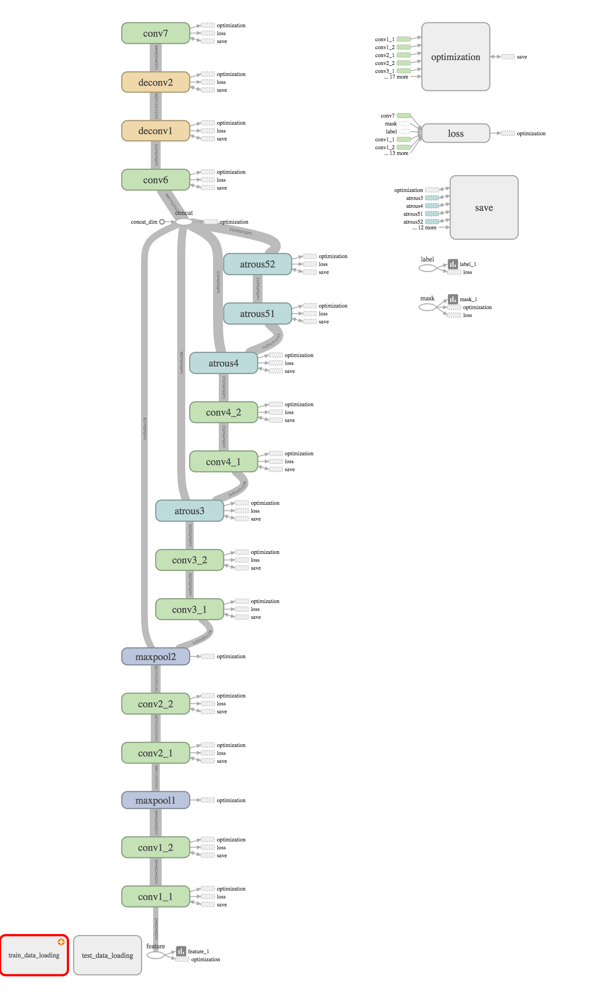

### Pre-requisites: TensorflowToolbox
The code is heavly depends on TensorflowToolbox

Install Instruction:

git clone https://github.com/polltooh/TensorflowToolbox.git

make sure it is in the python search path. 

Please notice that this github is still being developing. Therefore
some of the interface may be changed.

### Pre-requistes: Python Pacakge 
####xmltodict
pip install xmltodict

#### opencv
pip install opencv-python

# Video Analysis

### nn\_script
This directory contains the code for defining and training the network

train.py is the one training the network. Please copy model.tfproto.example to model.tfproto so the training script will auto-load the file. 

cp model.tfproto.example model.tfproto

The training parameter is
specified in the model.tfproto file

### file\_list
This directory contains the file\_list, which contains the path and the
filename of training and testing file 

### gen\_list\_script
This directory contains the scipt which used in generating the file\_list.

### data\_process\_script
This directory contains the script which used in processing.

### net work structure:

